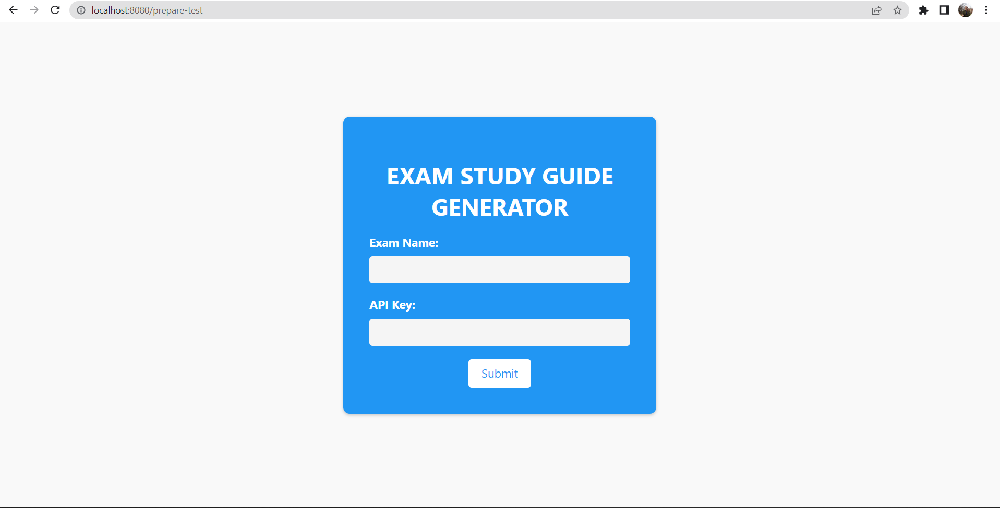

# Exam Preparation Generator
This is a simple web application that generates a guide on how to prepare for a given exam using OpenAI's GPT-3 language model. The guide is generated based on a prompt that asks the user to provide the name of the exam they want to prepare for.

## Getting Started
To use this application, you'll need an API key for OpenAI's GPT-3 language model. You can sign up for an API key here. Once you have an API key, you can start the server by running the following command:

```
go run main.go
```

This will start the server on port 8080. You can then access the application by visiting http://localhost:8080 in your web browser.

## Usage
To generate a guide for a specific exam, follow these steps:

1. Visit http://localhost:8080/prepare-test in your web browser.
2. Enter your OpenAI API key and the name of the exam you want to prepare for.
3. Click the "Generate Guide" button.
4. The application will then use the GPT-3 language model to generate a guide on how to prepare for the exam, which will be saved to a text file and downloaded to your computer.


Here is how it will look like when you start the server and follow to http://localhost:8080/prepare-test



## Contributing
Contributions to this project are welcome! If you would like to contribute, please open a pull request with your changes.

## License
This project is licensed under the MIT License. See the LICENSE file for more information.